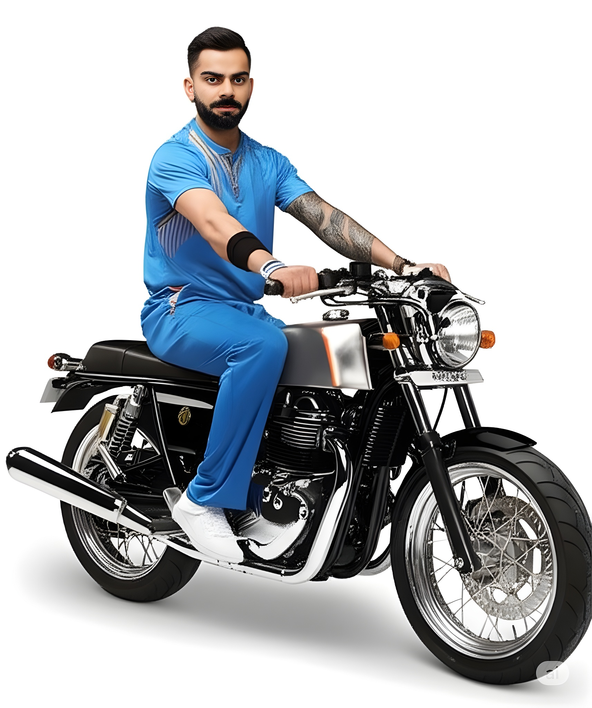

# VisionFusion-Face-Aware-AI-Editing
An AI-powered image composition pipeline using Gemini, InsightFace, GFPGAN, and RealESRGAN. It preserves facial identity while placing a source person into target scenes with prompts, restoring details and enhancing quality for photorealistic results.

  

An AI-powered image composition pipeline using **Google Gemini**, **InsightFace**, **GFPGAN**, and **RealESRGAN**.  
This project preserves facial identity while placing a source person into target scenes with prompts, restoring details, and enhancing quality for photorealistic results.  

### Note: This project is developed **for academic research purposes only** and is **not intended for commercial use**.  

---

## Features  
- Face Preservation – Accurate identity matching with InsightFace  
- Detail Restoration – GFPGAN enhances facial features  
- High-Resolution Upscaling – RealESRGAN sharpens and improves final results  
- Prompt-Based Placement – Gemini allows contextual scene edits  
- Seamless Blending – Smooth integration into target backgrounds  

---

## Project Structure  
- `notebook.ipynb` – Main Kaggle notebook with the full pipeline  
- `examples/` – Example input and output images  
- `README.md` – Project documentation  

---

## Usage  
1. Open the Kaggle notebook in your environment.  
2. Upload a **source image** (person), a **target/product image** (scene), and optionally provide a **prompt**.  
3. Run all cells to generate the composed output.  
4. The final image will be face-preserved, restored, and upscaled.  

---

## Examples  

Below is a step-by-step visual demonstration (images shown at the same size, side-by-side):  

| Step 1 — Source Image | Step 2 — Target Image | Step 3 — Generated Result (Face Preserved + GFPGAN + RealESRGAN) |
|------------------------|-----------------------|------------------------------------------------------------------|
|  |  |  |


---

## Requirements  
- Kaggle GPU (T4 recommended)  
- Python 3.10+  
- Dependencies:  
  ```bash
  pip install insightface gfpgan realesrgan opencv-python numpy torch transformers
